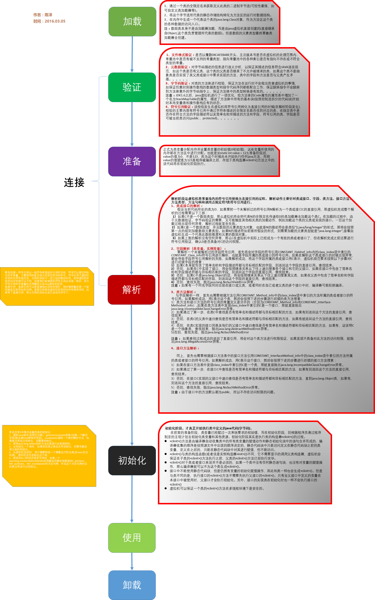

# OOP Design Pattern

[OOP Design Pattern](./doc/oop_design_patterns.md)

# Database Principles & Designs

[Database Principles & Designs](./doc/database_principles_n_designs.md)

# 编程理论

## 计算机语分类

- 编译型和解释型 (Compiled and Interpreted Languages)
  
  - 编译型语言首先是将源代码编译生成机器指令，再由机器运行机器码(二进制)
  - 解释型语言的源代码不是直接翻译成机器指令，而是先翻译成中间代码，再由解释器对中间代码进行解释运行。

- 动态语言和静态语言 (Dynamic and Static Languages)

  - 动态语言是一类在运行时可以改变其结构的语言。
  - 运行时结构不可变的语言就是静态语言。

- 动态类型语言和静态类型语言 (Dynamically Typed and Statically Typed Languages)

  - 动态类型语言在运行的时候（runtime）才检查数据类型。
  - 静态类型语言的数据类型是在编译期间确定的，编写代码的时候要明确确定变量的数据类型。

- 强类型和弱类型语言 (Strongly Typed and Weakly Typed Languages)

  - 强类型语言是强制数据类型定义的语言。也就是说，一旦一个变量被指定了某个数据类型，如果不经过强制转换，那么它就永远是这个数据类型了。
  - 弱类型语言是数据类型可以被忽略的语言。它与强类型定义语言相反，一个变量可以赋不同数据类型的值。

[强类型 & 弱类型 静态类型 & 动态类型](https://www.jianshu.com/p/7d45d8a50096)

## 异步，同步，阻塞与非阻塞

同步/异步主要针对C端: 

- 同步：
  
所谓同步，就是在c端发出一个功能调用时，在没有得到结果之前，该调用就不返回。

- 异步：
  
异步的概念和同步相对。当c端一个异步过程调用发出后，调用者不能立刻得到结果。实际处理这个调用的部件在完成后，通过状态、通知和回调来通知调用者。

阻塞/非阻塞主要针对S端:

- 阻塞
 
阻塞调用是指调用结果返回之前，当前线程会被挂起（线程进入非可执行状态，在这个状态下，cpu不会给线程分配时间片，即线程暂停运行）。函数只有在得到结果之后才会返回。

- 非阻塞
  
非阻塞和阻塞的概念相对应，指在不能立刻得到结果之前，该函数不会阻塞当前线程，而会立刻返回。

## 函数式编程 (Functional Programming)

定义:

函数式编程是一种编程范式。它把计算当成是数学函数的求值，从而避免改变状态和使用可变数据。它是一种声明式的编程范式，通过表达式和声明而不是语句来编程。

对比:

- 面向对象编程范式: 面向对象编程以数据为核心。特点是封装性, 灵活性和可维护性。缺点是代码冗长, 并发编程中对象状态不易维护。

- 命令式编程范式: 命令式编程的主要思想是关注计算机执行的步骤。缺点是抽象程度低, 语句的副作用影响线程安全性。

特性:

- 闭包和高阶函数
- 惰性计算
- 递归
- 函数是"第一等公民"
- 只用"表达式"，不用"语句"
- 没有"副作用"
- 不修改状态
- 引用透明性: 函数的返回值只依赖于其输入值
- 柯里化 (Currying) : 是把接受多个参数的函数变换成接受一个单一参数(最初函数的第一个参数)的函数，并且返回接受余下的参数且返回结果的新函数的技术

优点:

- 代码更为简洁，可读性更强。
- 接近自然语言，易于理解。
- 减少了状态变量的声明与维护，适合高并发多线程任务。

缺点

- 由于所有的数据都是不可变的，所以所有的变量在程序运行期间都是一直存在的，非常占用运行资源。
- 纯函数式编程没有IO操作。

[函数式编程思想概论](https://www.ibm.com/developerworks/cn/java/j-understanding-functional-programming-1/index.html)

[函数式编程](https://baike.baidu.com/item/%E5%87%BD%E6%95%B0%E5%BC%8F%E7%BC%96%E7%A8%8B/4035031?fr=aladdin)

# Java基础

## Java IO (java.io包) 流


[Java总结：Java 流(Stream)、文件(File)和IO](https://www.cnblogs.com/52fhy/p/8232825.html)

- Apache Common IO: IOUtils 常用操作

```java
IOUtils::copy(inputstream,outputstream)
IOUtils::copy(inputstream,writer)
IOUtils::copy(inputstream,writer,encoding)
IOUtils::copy(reader,outputstream)
IOUtils::copy(reader,writer)
IOUtils::copy(reader,writer,encoding)

IOUtils::copyLarge(reader,writer) 默认会用1024*4的buffer来读取
IOUtils::copyLarge(reader,writer,buffer)

IOUtils.toBufferedInputStream(inputstream)
```

## Java BIO, NIO, AIO

一个I/O操作其实分成了两个步骤：发起I/O请求和实际的I/O操作。

同步I/O和异步I/O的区别就在于第二个步骤是否阻塞，如果实际的I/O读写阻塞请求进程，那么就是同步I/O。

阻塞I/O和非阻塞I/O的区别在于第一步，发起I/O请求是否会被阻塞，如果阻塞直到I/O完成，那么就是传统的阻塞I/O，如果不阻塞，那么就是非阻塞。

- BIO (BLocking IO)

由java.io包提供, 同步阻塞。

- NIO (Non-blocking IO)

由java.nio包提供, 同步非阻塞。使用Selector多路复用。

- AIO (Async-IO)

由java.nio包提供, 异步非阻塞。

[Java核心（五）深入理解BIO、NIO、AIO](https://my.oschina.net/u/3471412/blog/2966696)

## 反射 (Reflection)

- 定义

通过采用某种机制来实现对自己行为的描述（self-representation）和监测（examination），并能根据自身行为的状态和结果，调整或修改应用所描述行为的状态和相关的语义。

- 实例

Reflection allows inspection of classes, interfaces, fields and methods at runtime without knowing the names of the interfaces, fields, methods at compile time. It also allows instantiation of new objects and invocation of methods.

  - Discover and modify source-code constructions (such as code blocks, classes, methods, protocols, etc.) as first-class objects at runtime.

  - Convert a string matching the symbolic name of a class or function into a reference to or invocation of that class or function.

  - Evaluate a string as if it were a source-code statement at runtime.

  - Create a new interpreter for the language's bytecode to give a new meaning or purpose for a programming construct.


- Java中的反射:

载入指定的类, 获取构造函数, 字段和方法

```java
public class StringBuf {
    public String str;
    public String toUpper() {
        return str.toUpperCase();
    }
}
```

```java
// 通过类名获取类
Class clazz = Class.forName("lzhou.learning.concurrency.concurrency.StringBuf";
	
// 获取所有注释
Annotation[] annotations = clazz.getAnnotations();
Assert.assertEquals(1, annotations.length);
// 获取注释
Annotation deprecatedAnnotation =clazz.getAnnotation(Deprecated.class);
Assert.assertNotNull(deprecatedAnnotation);
	
// 通过参数列表获取公有构造函数
StringBuf obj = (StringBuf) clazz.getConstructor(String.class).newInstance("Test");
	
// 通过方法名名称和方法参数, 获取公有方法
String val = (String) clazz.getMethod("toUpperCase",new Class<?>[0]).invoke(obj);
Assert.assertEquals("TEST", val);
	
// 通过名称获取公有字段
val = (String) clazz.getField("str").get(obj);
Assert.assertEquals("Test", val);
```

## JVM类加载过程



[JVM Architecture – Understanding JVM Internals](https://www.javainterviewpoint.com/java-virtual-machine-architecture-in-java/)

## JVM引用类型

|   类型   | 回收时间 |            使用场景    |
|----------|---------|-----------------------|
|  强引用  | 一直存活，除非GC Roots不可达 | 所有程序的场景，基本对象，自定义对象等。 |
|  软引用  | 内存不足时会被回收 | 一般用在对内存非常敏感的资源上，用作缓存的场景比较多 |
|  弱引用  | 只能存活到下一次GC前 | 生命周期很短的对象，例如ThreadLocal中的Key。 |
|  虚引用  | 随时会被回收， 创建了可能很快就会被回收 |  业界暂无使用场景， 可能被JVM团队内部用来跟踪JVM的垃圾回收活动 |

[Java中的四种引用类型（强、软、弱、虚）](https://www.jianshu.com/p/ca6cbc246d20)

## Java类型擦除 (Type Erasure)

Java的泛型只存在于编译时期，泛型使编译器可以在编译期间对类型进行检查以提高类型安全，减少运行时由于对象类型不匹配引发的异常。

- 类型擦除和类型具体化(Type Erasure and Type Reified)

  - 类型擦除
  
  泛型类型仅存在于编译期间，编译后的字节码和运行时不包含泛型信息。 例如Java。 

  - 类型具体化

  泛型类型存在于编译和运行期间，编译器自动为每一种泛型类型生成类型代码并编译进二进制码中。例如C++。 

- 类型擦除的局限性

  - 运行时隐含类型转换的开销

  - 类型参数不能实例化

  - 类型参数不能进行类型查询(类型查询在运行时，运行时类型参数已被擦除)

  - 不能在静态域和静态方法中引用类型变量

  - 重载方法签名冲突

  - 一个类不能实现同一个泛型接口的两种变体

  - 泛型类不能扩展java.lang.Throwable

[Java泛型: 类型擦除(type erasure)](https://segmentfault.com/a/1190000008711188)

## Java类型不变协变,逆变 (Type Invariant, Covariant, Contravariant)

定义:

如果A、B表示类型，f(⋅)表示类型转换，≤表示继承关系（比如，A≤B表示A是由B派生出来的子类）；


- f(⋅)是逆变（contravariant）的，当A≤B时有f(B)≤f(A)成立；

- f(⋅)是协变（covariant）的，当A≤B时有f(A)≤f(B)成立；

- f(⋅)是不变（invariant）的，当A≤B时上述两个式子均不成立，即f(A)与f(B)相互之间没有继承关系。

Java中泛型是不变的,而数组是协变的。

Integer是Number子类, 但是ArrayList<Integer>不是ArrayList<Number>子类。

```java
// 编译报错
// required ArrayList<Integer>, found ArrayList<Number>
ArrayList<Integer> list1 = new ArrayList<>();
ArrayList<Number> list2 = list1;
```

而Integer[]是Number[]子类。

```java
// 可以正常通过编译,正常使用
Integer[] arr1 = new Integer[]{1, 2};
Number[] arr2 = arr1;
```

[java泛型 通配符详解及实践](https://www.jianshu.com/p/e3d58360e51f)

## Java泛型通配符 (Generics Wildcard)

Java的泛型没有协变性和逆变性, 泛型通配符使Java泛型获得协变和逆变相似的效果。

- 无界限通配符

```java
List<?>
```

与`<? extends Object>`等效。

- 上界限通配符

```java
List<? extends 父类型>
```

使容器具有协变性, 即List<子类型>是List<父类型>的子类型。

因为可以确定父类型，所以可以以父类型去获取数据（向上转型）。但是不能写入数据。

Java泛型的类型信息已经被擦除为Object，无法做类型检测，只能依靠声明在编译时做严格的类型检查，上界限通配符声明意味着这个容器中的元素类型不确定，可能是任何子类，所以往里面添加任何类型都是不安全的。

例:

```java
List<? extends Fruit> a = new ArrayList<Apple>();
//a.add(new MochaCoffee()); //不能添加MochaCoffee
//a.add(new Coffee()); //也不能添加Coffee
a.add(null);
Fruit fruit = a.get(0);
```

- 下界限通配符

```java
List<? super 子类型>
```

使容器具有逆变性, 即List<父类型>是List<子类型>的子类型。

因为可以确定最小类型，所以可以以最小类型去写入数据（向下转型）。而不能获取数据。

例:

```java
List<? super Apple> a = new ArrayList<Fruit>();
a.add(new Apple());
```

- PECS原则 (Producer Extends Consumer Super)

  - 上界`<? extends T>`不能往里存，只能往外取
  - 下界`<? super T>`不影响往里存，但往外取只能放在Object对象里


[泛型通配符上下界限的理解](https://blog.csdn.net/wang252949/article/details/80583093)

# Java并发

## 并发性质

- 原子性

一个操作或者多个操作，要么全部执行并且执行的过程不会被任何因素打断，要么就都不执行。

- 有序性

即程序执行的顺序按照代码的先后顺序执行。

- 可见性

可见性是指当一个线程修改了共享变量后，其他线程能够立即得知这个修改。

注: volatile关键字保证有序性和可见性, 但不保证原子性。 Synchronized关键字保证有序性, 可见性和保证原子性。

## JVM线程状态


## JVM结束线程的方法

- 线程内return 

- 线程内抛出异常
- 调用Thread.stop() (已过时)

强制终止线程, 不保证线程逻辑完整, 和synchronized代码块里的原子性。

- 退出JVM

[[改善Java代码]不使用stop方法停止线程](https://www.cnblogs.com/DreamDrive/p/5623804.html)

## Thread.interrupt()

- 本线程中断自己是被允许的；其它线程调用本线程的interrupt()方法时，会通过checkAccess()检查权限。这有可能抛出SecurityException异常。
- 如果本线程是处于阻塞状态：调用线程的wait(), wait(long)或wait(long, int)会让它进入等待(阻塞)状态，或者调用线程的join(), join(long), join(long, int), sleep(long), sleep(long, int)也会让它进入阻塞状态。若线程在阻塞状态时，调用了它的interrupt()方法，那么它的“中断状态”会被清除并且会收到一个InterruptedException异常。
- 如果线程被阻塞在一个Selector选择器中，那么通过interrupt()中断它时；线程的中断标记会被设置为true，并且它会立即从选择操作中返回。
- 如果不属于前面所说的情况，那么通过interrupt()中断线程时，它的中断标记会被设置为“true”。
- 中断一个“已终止的线程”不会产生任何操作。

## 使用interrupt()优雅地中断线程

- 终止处于“阻塞状态”的线程

当线程由于被调用了sleep(), wait(), join()等方法而进入阻塞状态；若此时调用线程的interrupt()将线程的中断标记设为true。由于处于阻塞状态，中断标记会被清除，同时产生一个InterruptedException异常

```java
public void run() {
    try {
        while (true) {
            // 执行任务...
        }
    } catch (InterruptedException ie) {  
        // 由于产生InterruptedException异常，退出while(true)循环，线程终止！
    }
}
```

- 终止处于“运行状态”的线程

  - 通过“中断标记”终止线程

```java
@Override
public void run() {
    while (!isInterrupted()) {
        // 执行任务...
    }
}
```

  - 通过“额外添加标记”终止线程

```java
private volatile boolean flag = true;
public void stopThread() {
    flag = false;
}

@Override
public void run() {
    while (flag) {
        // 执行任务...
    }
}
```

  - 综合线程处于“阻塞状态”和“运行状态”的终止方式

```java
@Override
public void run() {
    try {
        // 1. isInterrupted()保证，只要中断标记为true就终止线程。
        while (!isInterrupted()) {
            // 执行任务...
        }
    } catch (InterruptedException ie) {  
        // 2. InterruptedException异常保证，当InterruptedException异常产生时，线程被终止。
    }
}
```

[Java多线程系列--“基础篇”09之 interrupt()和线程终止方式](https://www.cnblogs.com/skywang12345/p/3479949.html)

## ThreadLocal

- 原理

每个Thread内部维护着一个ThreadLocalMap，它是一个Map。这个映射表的Key是一个弱引用，其实就是ThreadLocal本身，Value是真正存的线程变量Object。


- 基本操作
 
  - `ThreadLocal.withInitial()`: 设置缺省值

  - `ThreadLocal.set(T value)`

  - `ThreadLocal.get()`

  - `ThreadLocal.remove()`: 删除ThreadLocalMap中的Entry

- 应用

  - 方便传参

	- 适用于线程由框架管理时

    ```java
	ThreadLocal<Integer> threadId = ThreadLocal.withInitial(()->curId.getAndIncrement());
    
    Runnable printDate = () -> {
            System.out.println(threadId.get());
        };
    ```

  - 线程私有的对象
	- 适用于该对象不需要在多线程之间共享；该对象需要在线程内被传递; 该对象的方法线程不安全时。
	- 典型场景: 数据库连接管理，线程会话管理等场景。

    ```java
	private static final ThreadLocal<Integer> simpleDateTimeFormat = ThreadLocal.withInitial(()->  new SimpleDateFormat());
    
    Runnable printDate = () -> {
            System.out.println(simpleDateTimeFormat.get().format(new Date()));
        };
    ```

- 内存泄漏

由于ThreadLocalMap的key是弱引用，而Value是强引用。ThreadLocal在没有外部对象强引用时，发生GC时弱引用Key会被回收，而Value不会回收. 这些null key就存在一条强引用链的关系一直存在：Thread --> ThreadLocalMap-->Entry-->Value。这条强引用链会导致Entry不会回收，Value也不会回收，但Entry中的Key却已经被回收的情况，造成内存泄漏。

- key 使用弱引用的原因

key 使用弱引用：引用的ThreadLocal的对象被回收了，由于ThreadLocalMap持有ThreadLocal的弱引用，即使没有手动删除，ThreadLocal也会被回收。value在下一次ThreadLocalMap调用set,get，remove的时候会被清除。

- 内存泄漏的根源

由于ThreadLocalMap的生命周期跟Thread一样长，如果没有手动删除对应key的value就会导致内存泄漏，而不是因为弱引用。


[ThreadLocal-面试必问深度解析](https://www.jianshu.com/p/98b68c97df9b)

[ThreadLocal内存泄漏真因探究](https://www.jianshu.com/p/a1cd61fa22da)

# Operating System

[Operating System](./doc/operating_system.md)

# Spring Framework

[Spring Framework](./doc/spring_framework.md)

# Redis

[Redis](./doc/redis.md)

