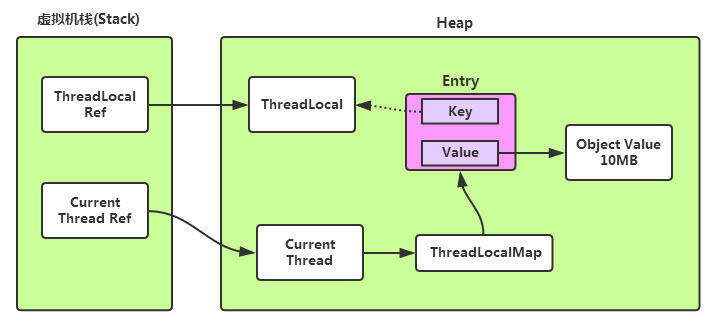

# 设计模式 (Design Pattern)

## 单例模式 (Singleton)

要点: 

  - 私有构建方法
  - 私有静态单例变量
  - 公有静态工厂方法

单线程版本:

```java
class Singleton {
	private static Singleton instance = null;
	private Singleton() {
	}
	public static Singleton getInstance() {
		if (instance==null) {
			instance = new Singleton();
		}
		return instance;
	}
}
```

简单多线程版本:

  - 把工厂方法改为同步块

```java
class Singleton {
	private static Singleton instance = null;
	private Singleton() {
	}

	public static synchronized Singleton getInstance() {
		if (instance==null) {
			instance = new Singleton();
		}
		return instance;
	}
}
```

双重检查锁定(DCL)版本:

  - 仅构建单例时进入同步块
  - 需要声明instance为volatile, 以确保可见性和顺序性

[双重检查锁定（double-checked locking）与单例模式](https://blog.csdn.net/zhangzeyuaaa/article/details/42673245)

```java
class Singleton {
	private static volatile Singleton instance = null;
	private Singleton() {
	}

	public static synchronized Singleton getInstance() {
		if (instance==null) {
			//DCL
			synchronized (Singleton.class) {
				if (instance==null) {
					instance = new Singleton();
				}
			}
		}
		return instance;
	}
}
```

# Database

## ACID原则

- 原子性（Atomicity）

个操作是不可中断的，要么全部执行成功要么全部执行失败

- 一致性（Consistency）

一致性是指事务必须使数据库从一个一致性状态变换到另一个一致性状态，也就是说一个事务执行之前和执行之后都必须处于一致性状态。

- 隔离性（Isolation）

 隔离性是当多个用户并发访问数据库时，比如操作同一张表时，数据库为每一个用户开启的事务，不能被其他事务的操作所干扰

- 持久性（Durability）

持久性是指一个事务一旦被提交了，那么对数据库中的数据的改变就是永久性的

[数据库ACID四大特性及脏读，不可重复读，幻读，事物丢失](https://blog.csdn.net/qq_35206244/article/details/82493215)

## 脏读，不可重复读，幻读区别

- 脏读

读取了未提交的新事物，然后被回滚了

比如事务B执行过程中修改了数据X，在未提交前，事务A读取了X，而事务B却回滚了，这样事务A就形成了脏读。

- 不可重复读

读取了提交的新事物，指更新操作

比如事务A首先读取了一条数据，然后执行逻辑的时候，事务B将这条数据改变了，然后事务A再次读取的时候，发现数据不匹配了

- 幻读

读取了提交的新事物，指插入或删除操作

比如事务A首先根据条件索引得到N条数据，然后事务B改变了这N条数据之外的M条或者增添了M条符合事务A搜索条件的数据，导致事务A再次搜索发现有N+M条数据了


[数据库ACID四大特性及脏读，不可重复读，幻读，事物丢失](https://blog.csdn.net/qq_35206244/article/details/82493215)


## 事务丢失

- 回滚丢失

比如A和B同时在执行一个数据，然后B事物已经提交了，然后A事物回滚了，这样B事务的操作就因A事物回滚而丢失了

- 提交覆盖丢失

比如A和B同时在执行，A读取数据, B更新该数据并提交, 然后A同样更新该数据并提交, 这样B事务的操作就因A事物覆盖而丢失了

## 隔离级别 (Isolation Level)

从隔离性低到高排序:

- 未提交读 (Read uncommitted)

写操作加写锁，读操作不加锁。

禁止第一类丢失更新。

- 提交读 (Read committed)

写操作加写锁，读操作加读锁。

禁止第一类丢失更新和脏读。


- 可重复读 (Read repeatable)

写操作加写锁到事务结束，读操作加读锁到事务结束。

禁止两类丢失更新，禁止脏读和不可重复度，但是可能出现幻读。

- 序列化 (Serializable)

对表级读 写加锁。

禁止两类丢失更新，禁止脏读, 不可重复度和禁止幻读。


# 编程基础 / Java

## 并发性质

- 原子性

一个操作或者多个操作，要么全部执行并且执行的过程不会被任何因素打断，要么就都不执行。

- 有序性

即程序执行的顺序按照代码的先后顺序执行。

- 可见性

可见性是指当一个线程修改了共享变量后，其他线程能够立即得知这个修改。

注: volatile关键字保证有序性和可见性, 但不保证原子性。 Synchronized关键字保证有序性, 可见性和保证原子性。

## JVM线程状态


## 函数式编程 (Functional Programming)

- 定义

函数式编程是一种编程范式。它把计算当成是数学函数的求值，从而避免改变状态和使用可变数据。它是一种声明式的编程范式，通过表达式和声明而不是语句来编程。

- 对比

  - 面向对象编程范式: 面向对象编程以数据为核心。特点是封装性, 灵活性和可维护性。缺点是代码冗长, 并发编程中对象状态不易维护。

  - 命令式编程范式: 命令式编程的主要思想是关注计算机执行的步骤。缺点是抽象程度低, 语句的副作用影响线程安全性。

- 特性

  - 闭包和高阶函数
  - 惰性计算
  - 递归
  - 函数是"第一等公民"
  - 只用"表达式"，不用"语句"
  - 没有"副作用"
  - 不修改状态
  - 引用透明性: 函数的返回值只依赖于其输入值
  - 柯里化 (Currying) : 是把接受多个参数的函数变换成接受一个单一参数(最初函数的第一个参数)的函数，并且返回接受余下的参数且返回结果的新函数的技术


- 优点

  - 代码更为简洁，可读性更强
  - 减少了状态变量的声明与维护，适合高并发多线程任务

- 缺点

  - 由于所有的数据都是不可变的，所以所有的变量在程序运行期间都是一直存在的，非常占用运行资源。
  - 纯函数式编程没有IO操作。

[函数式编程思想概论](https://www.ibm.com/developerworks/cn/java/j-understanding-functional-programming-1/index.html)

[函数式编程](https://baike.baidu.com/item/%E5%87%BD%E6%95%B0%E5%BC%8F%E7%BC%96%E7%A8%8B/4035031?fr=aladdin)

### 面向对象编程


## 反射 (Reflection)

- 定义

通过采用某种机制来实现对自己行为的描述（self-representation）和监测（examination），并能根据自身行为的状态和结果，调整或修改应用所描述行为的状态和相关的语义。

- 实例

Reflection allows inspection of classes, interfaces, fields and methods at runtime without knowing the names of the interfaces, fields, methods at compile time. It also allows instantiation of new objects and invocation of methods.

  - Discover and modify source-code constructions (such as code blocks, classes, methods, protocols, etc.) as first-class objects at runtime.

  - Convert a string matching the symbolic name of a class or function into a reference to or invocation of that class or function.

  - Evaluate a string as if it were a source-code statement at runtime.

  - Create a new interpreter for the language's bytecode to give a new meaning or purpose for a programming construct.


- Java中的反射:

载入指定的类, 获取构造函数, 字段和方法

```java
public class StringBuf {
    public String str;
    public String toUpper() {
        return str.toUpperCase();
    }
}
```

```java
	// 通过类名获取类
	Class clazz = Class.forName("lzhou.learning.concurrency.concurrency.StringBuf");
	
	// 获取所有注释
	Annotation[] annotations = clazz.getAnnotations();
	Assert.assertEquals(1, annotations.length);
	// 获取注释
	Annotation deprecatedAnnotation = clazz.getAnnotation(Deprecated.class);
	Assert.assertNotNull(deprecatedAnnotation);
	
	// 通过参数列表获取公有构造函数
	StringBuf obj = (StringBuf) clazz.getConstructor(String.class).newInstance("Test");
	
	// 通过方法名名称和方法参数, 获取公有方法
	String val = (String) clazz.getMethod("toUpperCase", new Class<?>[0]).invoke(obj);
	Assert.assertEquals("TEST", val);
	
	// 通过名称获取公有字段
    val = (String) clazz.getField("str").get(obj);
    Assert.assertEquals("Test", val);
```

## AOP 自我调用问题

[Spring AOP中自我调用的问题](https://blog.csdn.net/zknxx/article/details/72585822)

## ThreadLocal

- 原理

每个Thread内部维护着一个ThreadLocalMap，它是一个Map。这个映射表的Key是一个弱引用，其实就是ThreadLocal本身，Value是真正存的线程变量Object。



- 基本操作
 
  - `ThreadLocal.withInitial()`: 设置缺省值

  - `ThreadLocal.set(T value)`

  - `ThreadLocal.get()`

  - `ThreadLocal.remove()`: 删除ThreadLocalMap中的Entry

- 应用

  - 方便传参

    ```java
	ThreadLocal<Integer> threadId = ThreadLocal.withInitial(()->curId.getAndIncrement());
    
    Runnable printDate = () -> {
            System.out.println(threadId.get());
        };
    ```

  - 线程私有的对象

    ```java
	private static final ThreadLocal<Integer> simpleDateTimeFormat = ThreadLocal.withInitial(()->  new SimpleDateFormat());
    
    Runnable printDate = () -> {
            System.out.println(simpleDateTimeFormat.get().format(new Date()));
        };
    ```

  使用ThreadLocal的典型场景正如数据库连接管理，线程会话管理等场景，只适用于(一)该对象不需要在多线程之间共享；(二)该对象需要在线程内被传递。

- 内存泄漏

由于ThreadLocalMap的key是弱引用，而Value是强引用。ThreadLocal在没有外部对象强引用时，发生GC时弱引用Key会被回收，而Value不会回收. 这些null key就存在一条强引用链的关系一直存在：Thread --> ThreadLocalMap-->Entry-->Value。这条强引用链会导致Entry不会回收，Value也不会回收，但Entry中的Key却已经被回收的情况，造成内存泄漏。

- key 使用弱引用的原因

key 使用弱引用：引用的ThreadLocal的对象被回收了，由于ThreadLocalMap持有ThreadLocal的弱引用，即使没有手动删除，ThreadLocal也会被回收。value在下一次ThreadLocalMap调用set,get，remove的时候会被清除。

- 内存泄漏的根源

由于ThreadLocalMap的生命周期跟Thread一样长，如果没有手动删除对应key的value就会导致内存泄漏，而不是因为弱引用。


[ThreadLocal-面试必问深度解析](https://www.jianshu.com/p/98b68c97df9b)

[ThreadLocal内存泄漏真因探究](https://www.jianshu.com/p/a1cd61fa22da)

## JVM引用类型

|   类型   | 回收时间 |            使用场景    |
|----------|---------|-----------------------|
|  强引用  | 一直存活，除非GC Roots不可达 | 所有程序的场景，基本对象，自定义对象等。 |
|  软引用  | 内存不足时会被回收 | 一般用在对内存非常敏感的资源上，用作缓存的场景比较多 |
|  弱引用  | 只能存活到下一次GC前 | 生命周期很短的对象，例如ThreadLocal中的Key。 |
|  虚引用  | 随时会被回收， 创建了可能很快就会被回收 |  业界暂无使用场景， 可能被JVM团队内部用来跟踪JVM的垃圾回收活动 |

[Java中的四种引用类型（强、软、弱、虚）](https://www.jianshu.com/p/ca6cbc246d20)


# Spring Boot / Cloud

## Spring Boot Runner 启动器

[]()

# Operating System

## 进程状态


