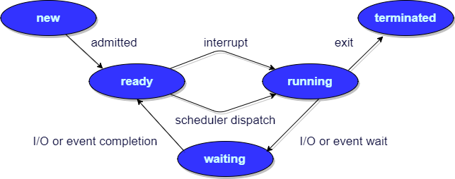

# 设计模式 (Design Pattern)

## 单例模式 (Singleton)

要点: 

  - 私有构建方法
  - 私有静态单例变量
  - 公有静态工厂方法

单线程版本:

```java
class Singleton {
	private static Singleton instance = null;
	private Singleton() {
	}
	public static Singleton getInstance() {
		if (instance==null) {
			instance = new Singleton();
		}
		return instance;
	}
}
```

简单多线程版本:

  - 把工厂方法改为同步块

```java
class Singleton {
	private static Singleton instance = null;
	private Singleton() {
	}

	public static synchronized Singleton getInstance() {
		if (instance==null) {
			instance = new Singleton();
		}
		return instance;
	}
}
```

双重检查锁定(DCL)版本:

  - 仅构建单例时进入同步块
  - 需要声明instance为volatile, 以确保可见性和顺序性

[双重检查锁定（double-checked locking）与单例模式](https://blog.csdn.net/zhangzeyuaaa/article/details/42673245)

```java
class Singleton {
	private static volatile Singleton instance = null;
	private Singleton() {
	}

	public static synchronized Singleton getInstance() {
		if (instance==null) {
			//DCL
			synchronized (Singleton.class) {
                if (instance==null) {
				    instance = new Singleton();
                }
			}
		}
		return instance;
	}
}
```

# Database

## ACID原则

- 原子性（Atomicity）

个操作是不可中断的，要么全部执行成功要么全部执行失败

- 一致性（Consistency）

一致性是指事务必须使数据库从一个一致性状态变换到另一个一致性状态，也就是说一个事务执行之前和执行之后都必须处于一致性状态。

- 隔离性（Isolation）

 隔离性是当多个用户并发访问数据库时，比如操作同一张表时，数据库为每一个用户开启的事务，不能被其他事务的操作所干扰

- 持久性（Durability）

持久性是指一个事务一旦被提交了，那么对数据库中的数据的改变就是永久性的

[数据库ACID四大特性及脏读，不可重复读，幻读，事物丢失](https://blog.csdn.net/qq_35206244/article/details/82493215)

## 脏读，不可重复读，幻读区别

- 脏读

读取了未提交的新事物，然后被回滚了

比如事务B执行过程中修改了数据X，在未提交前，事务A读取了X，而事务B却回滚了，这样事务A就形成了脏读。

- 不可重复读

读取了提交的新事物，指更新操作

比如事务A首先读取了一条数据，然后执行逻辑的时候，事务B将这条数据改变了，然后事务A再次读取的时候，发现数据不匹配了

- 幻读

读取了提交的新事物，指插入或删除操作

比如事务A首先根据条件索引得到N条数据，然后事务B改变了这N条数据之外的M条或者增添了M条符合事务A搜索条件的数据，导致事务A再次搜索发现有N+M条数据了


[数据库ACID四大特性及脏读，不可重复读，幻读，事物丢失](https://blog.csdn.net/qq_35206244/article/details/82493215)


## 事务丢失

- 回滚丢失

比如A和B同时在执行一个数据，然后B事物已经提交了，然后A事物回滚了，这样B事务的操作就因A事物回滚而丢失了

- 提交覆盖丢失

比如A和B同时在执行，A读取数据, B更新该数据并提交, 然后A同样更新该数据并提交, 这样B事务的操作就因A事物覆盖而丢失了

## 隔离级别 (Isolation Level)

从隔离性低到高排序:

- 未提交读 (Read uncommitted)

写操作加写锁，读操作不加锁。

禁止第一类丢失更新。

- 提交读 (Read committed)

写操作加写锁，读操作加读锁。

禁止第一类丢失更新和脏读。


- 可重复读 (Read repeatable)

写操作加写锁到事务结束，读操作加读锁到事务结束。

禁止两类丢失更新，禁止脏读和不可重复度，但是可能出现幻读。

- 序列化 (Serializable)

对表级读 写加锁。

禁止两类丢失更新，禁止脏读, 不可重复度和禁止幻读。


# 编程基础 / Java

## 并发性质

- 原子性

一个操作或者多个操作，要么全部执行并且执行的过程不会被任何因素打断，要么就都不执行。

- 有序性

即程序执行的顺序按照代码的先后顺序执行。

- 可见性

可见性是指当一个线程修改了共享变量后，其他线程能够立即得知这个修改。

注: volatile关键字保证有序性和可见性, 但不保证原子性。 Synchronized关键字保证有序性, 可见性和保证原子性。

## JVM线程状态


## 反射 (Reflection)

- 定义

reflection is the ability of a computer program to examine, introspect, and modify its own structure and behavior at runtime.

- 例子

Reflection allows inspection of classes, interfaces, fields and methods at runtime without knowing the names of the interfaces, fields, methods at compile time. It also allows instantiation of new objects and invocation of methods.

  - Discover and modify source-code constructions (such as code blocks, classes, methods, protocols, etc.) as first-class objects at runtime.

  - Convert a string matching the symbolic name of a class or function into a reference to or invocation of that class or function.

  - Evaluate a string as if it were a source-code statement at runtime.

  - Create a new interpreter for the language's bytecode to give a new meaning or purpose for a programming construct.


Java Hello World Example:

```java

// Without reflection
Foo foo = new Foo();
foo.hello();

// With reflection
Object foo = Class.forName("complete.classpath.and.Foo").newInstance();

// Alternatively: Object foo = Foo.class.newInstance();
Method m = foo.getClass().getDeclaredMethod("hello", new Class<?>[0]);
m.invoke(foo);

```

# Operating System

## 进程状态


