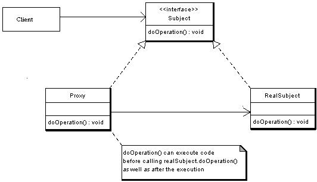
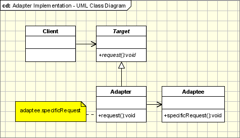
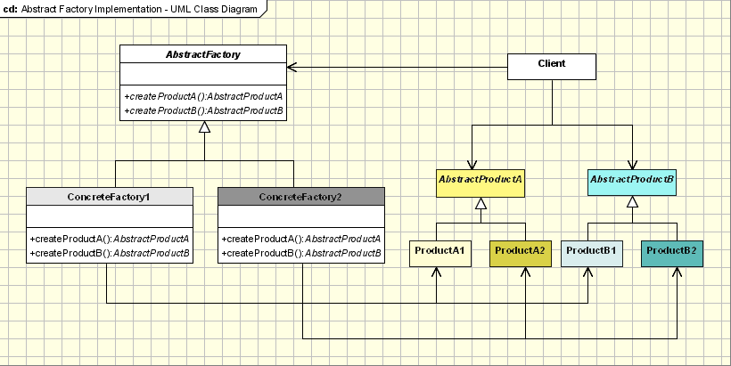

# 面向对象设计模式 (OOP Design Pattern)

## 设计模式六大原则 (SOLID)

- 单一职责原则 (Single Responsibility Principle)

- 开闭原则 (Open-Close Principle)

  对扩展开放，对修改关闭。

- 迪米特原则 (Law of Demeter)

  一个实体应当尽量少的与其他实体之间发生相互作用，使得系统功能模块相对独立。

- 里氏替换原则 (Liskov Substitution Principle)

  只有当衍生类可以替换掉基类，软件单位的功能不受到影响时，基类才能真正被复用，而衍生类也能够在基类的基础上增加新的行为。

- 接口隔离原则 (Interface Segregation Principle)

　使用多个隔离的接口来降低耦合度。

- 依赖倒置原则 (Dependence Inversion Principle)

  这个是开闭原则的基础，对接口编程，依赖于抽象而不依赖于具体。

[大话设计模式——六大原则(SOLID)](https://blog.csdn.net/bskfnvjtlyzmv867/article/details/76735749)

## 单例模式 (Singleton)

功能: 

  - 保证一个类只有一个实例并且这个实例易于被访问

核心结构: 

  - 私有构建方法
  - 私有静态单例变量
  - 公有静态工厂方法
  
应用场景:

  - Logger Classes
  - Configuration Classes
  - Accesing resources in shared mode

单线程版本:

```java
class Singleton {
	private static Singleton instance = null;
	private Singleton() {
	}
	public static Singleton getInstance() {
		if (instance==null) {
			instance = new Singleton();
		}
		return instance;
	}
}
```

简单多线程版本:

  - 把工厂方法改为同步块

```java
class Singleton {
	private static Singleton instance = null;
	private Singleton() {
	}

	public static synchronized Singleton getInstance() {
		if (instance==null) {
			instance = new Singleton();
		}
		return instance;
	}
}
```

双重检查锁定(DCL)版本:

  - 仅构建单例时进入同步块
  - 需要声明instance为volatile, 以确保可见性和顺序性

[双重检查锁定（double-checked locking）与单例模式](https://blog.csdn.net/zhangzeyuaaa/article/details/42673245)

```java
class Singleton {
	private static volatile Singleton instance = null;
	private Singleton() {
	}

	public static synchronized Singleton getInstance() {
		if (instance==null) {
			//DCL
			synchronized (Singleton.class) {
				if (instance==null) {
					instance = new Singleton();
				}
			}
		}
		return instance;
	}
}
```

## 访问者模式(Visitor Pattern)和双分派(Double Dispatch)


## 观察者模式(Observer Pattern)


## 代理模式(Proxy Pattern)

功能: 

  - 通过引入代理对象的方式来间接访问目标对象, 防止直接访问目标对象给系统带来的不必要复杂性

核心结构: 

  - 抽象对象接口（Subject）
  - 真实对象类（RealSubject）, 实现抽象对象接口
  - 代理对象类（Proxy）, 实现抽象对象接口, 维护真实对象类的引用, 并通过代理类创建真实对象实例并访问其方法

应用场景:

  - 保护代理
  - 远程代理
  - 智能引用代理
  - Cache代理
  


[代理模式](https://www.jianshu.com/p/a8aa6851e09e)

## 适配器模式(Adaptor Pattern)

功能: 

  - 把一个类的接口变换成客户端所期待的另一种接口，从而使原本接口不匹配而无法一起工作的两个类能够在一起工作。
  
核心结构: 

  - 目标接口Target, 期待调用Request方法;
  - 源类（Adaptee）, 需要被包装;
  - 适配器类（Adapter）, 把Adaptee包装, 使Adaptee与Target衔接.



```java
// 步骤1： 创建Target接口；
public interface Target {
 
    //这是源类Adapteee没有的方法
    public void Request(); 
}

// 步骤2： 创建源类（Adaptee） ；
public class Adaptee {
    
    public void SpecificRequest(){
    }
}

// 步骤3： 创建适配器类（Adapter）
//适配器Adapter继承自Adaptee，同时又实现了目标(Target)接口。
public class Adapter extends Adaptee implements Target {

    //目标接口要求调用Request()这个方法名，但源类Adaptee没有方法Request()
    //因此适配器补充上这个方法名
    //但实际上Request()只是调用源类Adaptee的SpecificRequest()方法的内容
    //所以适配器只是将SpecificRequest()方法作了一层封装，封装成Target可以调用的Request()而已
    @Override
    public void Request() {
        this.SpecificRequest();
    }

}
```

## 简单工厂(Simple Factory), 工厂方法(Factory Method)和抽象工厂模式(Abstract Factory)

### 简单工厂(Simple Factory)


功能: 

  - 封装子类以及子类的初始化逻辑, 外部仅使用物件的基类接口.
  - 使添加子类更灵活.

核心结构: 

  - 抽象产品类 & 定义具体产品的公共接口;
  - 具体产品类;
  - 工厂类，通过创建静态方法根据传入不同参数从而创建不同具体产品类的实例.
  
```java
// 步骤1. 创建抽象产品类，定义具体产品的公共接口
abstract class Product{
    public abstract void Show();
}

// 步骤2. 创建具体产品类（继承抽象产品类），定义生产的具体产品

//具体产品类A
class  ProductA extends  Product{

    @Override
    public void Show() {
        System.out.println("生产出了产品A");
    }
}

//具体产品类B
class  ProductB extends  Product{

    @Override
    public void Show() {
        System.out.println("生产出了产品C");
    }
}

//具体产品类C
class  ProductC extends  Product{

    @Override
    public void Show() {
        System.out.println("生产出了产品C");
    }
}

// 步骤3. 创建工厂类，通过创建静态方法从而根据传入不同参数创建不同具体产品类的实例
class  Factory {
    public static Product Manufacture(String ProductName){
//工厂类里用switch语句控制生产哪种商品；
//使用者只需要调用工厂类的静态方法就可以实现产品类的实例化。
        switch (ProductName){
            case "A":
                return new ProductA();

            case "B":
                return new ProductB();

            case "C":
                return new ProductC();

            default:
                return null;

        }
    }
}
```


### 工厂方法(Factory Method)


功能: 

  - 进一步解耦, 把创建产品子类的逻辑交给具体工厂类

核心结构: 

  - 抽象产品类 & 定义具体产品的公共接口;
  - 具体产品类;
  - 工厂类;
  - 具体工厂类，通过创建静态方法根据传入不同参数从而创建不同具体产品类的实例.

### 抽象工厂模式(Abstract Factory)



抽象工厂模式，即Abstract Factory Pattern，提供一个创建一系列相关或相互依赖对象的接口，而无须指定它们具体的类；具体的工厂负责实现具体的产品实例。

抽象工厂模式与工厂方法模式最大的区别：抽象工厂中每个工厂可以创建多种类的产品；而工厂方法每个工厂只能创建一类

功能: 

  - 允许使用抽象的接口来创建一组相关产品
  
核心结构:

  - 抽象工厂类，定义具体工厂的公共接口；
  - 抽象产品族类 ，定义抽象产品的公共接口；
  - 抽象产品类 （继承抽象产品族类），定义具体产品的公共接口；
  - 具体产品类（继承抽象产品类） & 定义生产的具体产品；
  - 具体工厂类（继承抽象工厂类），定义创建对应具体产品实例的方法；
  - 客户端通过实例化具体的工厂类，并调用其创建不同目标产品的方法创建不同具体产品类的实例

应用场景:

  - 个系统不要求依赖产品类实例如何被创建、组合和表达的表达，这点也是所有工厂模式应用的前提。
  - 这个系统有多个系列产品，而系统中只消费其中某一系列产品

[抽象工厂模式](https://www.jianshu.com/p/7deb64f902db)

## 建造者模式(Builder Pattern)

# 数据结构与算法

## 排序算法的稳定性

- 定义

稳定性是指待排序的序列中有两元素相等,排序之后它们的先后顺序不变.

- 稳定性算法:   

  - 基数排序
  - 直接插入排序
  - 冒泡排序
  - 归并排序

- 不稳定性算法: 

  - 桶排序
  - 二分插入排序
  - 希尔排序
  - 快速排序
  - 简单选择排序
  - 堆排序

[数据结构中各种排序算法的稳定性比较](https://blog.csdn.net/guoke2017/article/details/80929134)