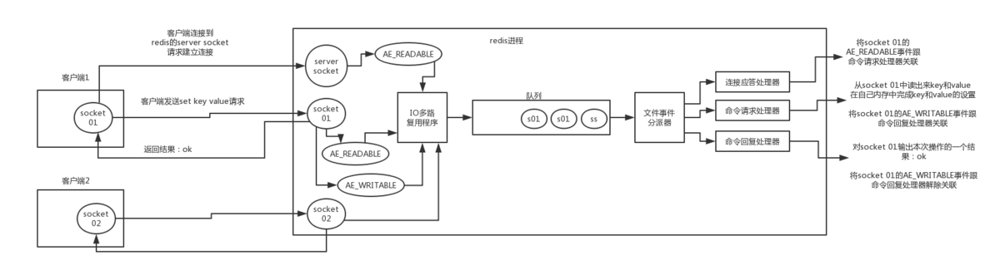

# Redis

[Redis 命令参考 ](http://redisdoc.com/script/index.html)
[Redis Tutorial](https://www.tutorialspoint.com/redis/)

## What is Redis 

Redis is an open source, in-memory data structure store, it can be used as a database, cache and message broker.

## Redis Thread Model 

- 使用多个socket监听
- 使用IO多路复用处理IO事件, 并添加到一个事件队列
- 文件处理分派器获取事件, 并将事件交给事件处理器
- 事件处理器（连接应答处理器、命令请求处理器、命令回复处理器）



## Reasons for Performance 
   
- In-memory database,
- IO Multiplexing,
- No context switch and lock.

[redis面试必问（上）](https://www.jianshu.com/p/f8ab9a75c1e0)

## Redis基础数据结构

- String

  Redis string is a sequence of bytes. Strings in Redis are binary safe. 
  
  Strings can store 3 types:
  
  - byte strings (Bitmaps),
  - integers,
  - floating point values.
  
  *Note*: A string value can be at max 512 megabytes in length.

- List

  Redis Lists are simply lists of strings, sorted by insertion order. You can add elements to a Redis List on the head or on the tail.
  
  *Note*: The max number of members in a list is `2^32 - 1`.  

- Hash

  A Redis hash is a collection of key value pairs.
  
  *Note*: Every hash can store up to `2^32 - 1` field-value pairs.

- Set

  Redis Sets are an unordered collection of strings. In Redis, you can add, remove, and test for the existence of members in O(1) time complexity.
  
  *Note*: The max number of members in a set is `2^32 - 1`.

- ZSet

  Every element in a sorted set is associated with a floating point value. Elements are ordered in the following rules:

  - If A and B are two elements with a different score, then A > B if A.score is > B.score.
  - If A and B have exactly the same score, then A > B if the A string is lexicographically greater than the B string. A and B strings can't be equal since sorted sets only have unique elements.


## Redis高级数据结构

- Hyperloglog

  HyperLogLog provides a very good approximation of the cardinality of a set even using a very small amount of memory around 12 kbytes per key with a standard error of 0.81%.

  *Note* : The maximum cardinality is approximately 2^64.
  
- Pub/Sub

  - A client can subscribe to any number of channels.
  - If a publisher publishes a message, all subscribers will receive the message. 
  
  *Note* : A subscriber must be online to receive messages. All messages sent while the subscriber is offline, is lost.

- Geo

[Redis - Data Types](http://www.tutorialspoint.com/redis/redis_data_types.htm)

## Redis Key Command

|     Command                |  Description    |
| `DEL <key>`                |  Deletes the key, if it exists.  |
| `EXISTS <key>`             | Checks whether the key exists or not. |
| `MOVE <key> <db>`          | Moves a key to another database. |
| `RENAME <key> <newKey>`    | Changes the key name.  |
| `RENAMENX <key> <newKey>`  | Renames the key, if the new key doesn't exist. |
| `TYPE <key>`               | Returns the data type of the value stored in the key. |

## Redis String Command

- Byte string operations:

|     Command                |  Description    |
|----------------------------|----------------------|
| `GET <key>`                |  Gets the value.  |
| `SET <key> <value>`                | Sets the value. |
| `MGET <key> [<value> ...]`                |  Gets the values.  |
| `MSET <key> <value> [<key> <value> ...]` | Sets the values. |
| `GETSET <key> <value>`     | Sets the value and returns the old value. |
| `STRLEN <key>`             | Gets the string length.  |
| `APPEND <key> <value>`          | Appends a value. |
| `GETRANGE <key> <start> <end>`    | Gets a substring of the string. Indices start from 0, and are inclusive. |
| `SETRANGE <key> <offset> <value>`  | Overwrites the part of a string at the key starting at the specified offset. |
| `SETNX <key> <value>`      | Sets the value if the key does not exist. |

*Note*: Substring outside the byte string will be considered as an empty string.

- Bitmap operations:.

|     Command                |  Description    |
|----------------------------|----------------------|
| `GETBIT <key> <offset>`                |  Gets the bit value at the offset. |
| `SETBIT <key> <offset> <value>`             | Sets the bit value at the offset. |
| `BITCOUNT <key> [<start> <end>]`          | Count the number of 1-bit in the string (or in the specified range). |
| `BITOP <key> <operation> <dest-key> <key> [<key> ...]`    | Applies bitwise operation (AND, OR, XOR, NOT) to specified keys, and stores the result in the `<dest-key>`. |

*Note*: Bits outside the bitmap will be considered as 0.

- Integer / floating point operations:

|     Command             |  Description    |
|-------------------------|----------------------|
| `INCR <key>`              | Increments the value by 1; returns the new value.  |
| `DECR <key>`              | Decrements the value by 1; returns the new value. |
| `INCRBY <key> <amount>`              | Increments the value by integer value `<amount>`; returns the new value. |
| `DECRBY <key> <amount>`              | Decrements the value by integer value `<amount>`; returns the new value. |
| `INCRBYFLOAT <key> <amount>`              |  Increments the value by float value `<amount>`; returns the new value.  |

- String operations:

|     Command             |  Description    |
|-------------------------|----------------------|

## Redis List Commands

- Non-blocking commands

|     Command             |  Description    |
|-------------------------|----------------------|
| `RPUSH <key> <value> [<value> ...]`   | Pushes the values to the right (tail) of a list. |
| `LPUSH <key> <value> [<value> ...]`   | Pushes the values to the left (head) of a list. |
| `RPOP <key>`                          | Remove and retrieves the value from the right of a list. |
| `LPOP <key>`                          | Remove and retrieves the value from the left of a list. |
| `LINDEX <key> <offset>`               | Retrieves the element at the index. |
| `LRANGE <key> <start> <end>`          | Gets the sublist from the specified range. |
| `LTRIM <key> <start> <end>`           | Trims a list. Keeps the elements in the specified range (inclusive). |
| `RPOPLPUSH <source-key> <dest-key>`   | Removes the rightmost value from `<source-key>`; push the value to the left of `<dest-key>`; and retrieves the value. If `<source-key>` is empty, nothing happens. |

*Note*: When the list is empty, these commands return `Nil`.

- Blocking commands

|     Command                                      |  Description    |
|--------------------------------------------------|----------------------|
| `BRPOP <key> <timeout>`                          | Remove and retrieves the value from the right of the list. Or blocks for `<timeout>` seconds when the list is empty.  |
| `BLPOP <key> <timeout>`                          | Remove and retrieves the value from the left of the list. Or blocks for `<timeout>` seconds when the list is empty. |
| `BRPOPLPUSH <source-key> <dest-key> <timeout>`   | Removes the rightmost value from `<source-key>`; push the value to the left of `<dest-key>`; and retrieves the value. Or blocks for `<timeout>` seconds when `<source-key>` is empty. |

## Redis Hash Commands

|     Command                                           |  Description         |
|-------------------------------------------------------|----------------------|
| `HGET <key> <field>`                                  | Gets the hash field value. |
| `HSET <key> <field> <value>`                          | Sets the hash field value.  |
| `HSETNX <key> <field> <value>`                        | Sets the hash field value only if the field does not exist.  |
| `HMGET <key> <field> [<field> ...]`                   | Gets one or more hash field values. |
| `HMSET <key> <field> <value> [<field> <value> ...]`   | Sets one or more hash field values. |
| `HDEL <key> <field>`                                  | Removes the hash field. |
| `HLEN <key>`                                          | Gets the number of fields in a hash. |
| `HEXISTS <key> <field>`                               | Determines whether a hash field exists or not. |
| `HKEYS <key>`                                         | Gets all the field names in a hash. |
| `HVALS <key>`                                         | Gets all the values in a hash. |
| `HGETALL <key>`                                       | Gets all the field-value pairs in a hash. |
| `HINCRBY <key> <field> <amount>`                      | Increments the integer value of a hash field by the given amount. |
| `HINCRBYFLOAT <key> <field> <amount>`                 | Increments the float value of a hash field by the given amount. |

## Redis Set Commands

- Commands on a single set

|     Command                                      |  Description         |
|--------------------------------------------------|----------------------|
| `SADD <key> <element> [<element> ...]`           | Adds an element to a set. |
| `SREM <key> <element> [<element> ...]`           | Removes an element from a set. |
| `SISMEMBER <key> <element>`                      | Determines whether an element is in a set. |
| `SCARD <key>`                                    | Gets the cardinality in a set. |
| `SMEMBERS <key>`                                 | Gets all the elements in a set. |
| `SRANDMEMBER <key> [<count>]`                    | Get 1 or `<count>` random members. If `<count> gt 0`, the members are unique. If `<count> lt 0`, the members may repeat.
| `SPOP <key>`                                     | Randomly removes an element from a set; and returns the element. |
| `SMOVE <source-key> <dest-key> <element>`        | If `<source-key>` has the element, removes the element from `<source-key>` and adds it to `<dest-key>`. Returns `1` on success, `0` otherwise.|

- Commands on multiple sets

|     Command                                      |  Description         |
|--------------------------------------------------|----------------------|
| `SDIFF <key1> [<key2> ...]`                      | Returns the items in  the first set `<key1>` but not in other sets. |
| `SINTER <key1> [<key2> ...]`                     | Returns the items in all sets. |
| `SUNION <key1> [<key2> ...]`                     | Returns the items in any sets. |
| `SDIFFSTORE <dest-key> <key1> [<key2> ...]`      | Adds in the `<dest-key>` the items in the first set `<key1>` but not in other sets. |
| `SINTERSTORE <dest-key> <key1> [<key2> ...]`     | Adds in the `<dest-key>` the items in all sets. |
| `SUNIONSTORE <dest-key> <key1> [<key2> ...]`     | Adds in the `<dest-key>` the items in any sets.  |

## Redis Ordered Set Commands

|     Command                                            |  Description         |
|--------------------------------------------------------|----------------------|
| `ZADD <key> <score> <element> [<score> <element> ...]` | Adds the element to a sorted set. |
| `ZREM <key> <element> [<element> ...]`                 | Removes the element from a sorted set. |
| `ZCARD <key>`                                          | Gets the cardinality of a sorted set. |
| `ZINCRBY <key> <increment> <element>`                  | Increments the score of the element. |
| `ZCOUNT <key> <min> <max>`                             | Counts the number of elements with scores in the range. |
| `ZRANK <key> <element>`                                | Returns the rank of the element. Rank starts from 0. | 
| `ZSCORE <key> <element>`                               | Returns the score of the element. |
| `ZRANGE <key> <start> <stop> [WITHSCORES]`             | Returns the elements whose ranks are in the range. If `WITHSCORES` option is set, the element-score pairs are returned. |
| `ZREVRANK <key> <element>`                             | Gets the rank of the element, with scores ordered from high to low. |
| `ZREVRANGE <key> <start> <stop> [WITHSCORES]`          | Returns the elements whose ranks are in the range, with scores ordered from high to low. |
| `ZRANGEBYSCORE <key> <min> <max> [WITHSCORES] [LIMIT offset count]`       | Returns the elements whose scores are in the range. |
| `ZREVRANGEBYSCORE <key> <min> <max> [WITHSCORES] [LIMIT offset count]`    | Returns the elements whose scores are in the range, with scores ordered from high to low. |
| `ZREMRANGEBYRANK <key> <start> <stop>`                 | Removes the elements whose ranks are in the range. |
| `ZREMRANGEBYSCORE <key> <min> <max>`                   | Removes the elements whose scores are in the range. |
| `ZINTERSTORE <dest-key> <key-count> <key> [<key> ...] [WEIGHTS weight [weight ...]] [AGGREGATE SUM/MIN/MAX]`   | Intersects multiple sorted sets and stores the resulting sorted set in a new key |
| `ZUNIONSTORE <dest-key> <key-count> <key> [<key> ...] [WEIGHTS weight [weight ...]] [AGGREGATE SUM/MIN/MAX]`   | Unions multiple sorted sets and stores the resulting sorted set in a new key |


## Redis HyperLogLog Commands

|     Command                                      |  Description         |
|--------------------------------------------------|----------------------|
| `PFADD <key> <element>`           |  Adds the specified elements to the specified HyperLogLog.  |
| `PPFCOUNT <key>`                | Returns the approximated cardinality of the set(s) observed by the HyperLogLog.  |
| `PPFMERGE <destkey> <key> [<key> ...]`  | Merges different HyperLogLogs into a single one.   |

## Redis Geo Commands

|     Command                                      |  Description         |
|--------------------------------------------------|----------------------|
| `GEOADD <key> <longitude> <latitude> <member> [<longitude> <latitude> <member> ...]` | Adds a member to a key. |
| `GEODIST <key> <member1> <member2> [<unit>]`     | Returns the distance between two members. |
| `GEOHASH <key> <member> [<member> ...]`          | Returns a list of geohashes of the members. |
| `GEOPOS <key> <member> [<member> ...]`           | Returns a list of `(longitude, latitude)` pairs of the members. |
| `GEORADIUS <key> <longitude> <latitude> <radius> <unit> [WITHCOORD] [WITHDIST] [WITHHASH] [COUNT count] [ASC/DESC] [STORE key] [STOREDIST key] ` | Return the members which are within the borders of the area specified with the center location and the maximum distance from the center (the radius). |
| `GEORADIUSBYMEMBER <key> <member> <radius> <unit> [WITHCOORD] [WITHDIST] [WITHHASH] [COUNT count] [ASC/DESC] [STORE key] [STOREDIST key]` | Return the members which are within the radius of a member location. |

- Units can be :

  - **m** for meters.
  - **km** for kilometers.
  - **mi** for miles.
  - **ft** for feet.

## Redis Public / Subscribe Commands

|     Command                                      |  Description         |
|--------------------------------------------------|----------------------|
| `PUBLISH <channel> <message>`                    | Posts a message onto a channel. |
| `SUBSCRIBE <channel> [<channel> ...]`            | Subscribes to 1 or more channels. |
| `UNSUBSCRIBE [<channel> [<channel> ...]]`        | Stops listening for messages posted to channels. |
| `PSUBSCRIBE <pattern> [<pattern> ...]`           | Subscribes to 1 or more channels matching the pattern. |
| `PUNSUBSCRIBE [<pattern> [<pattern> ...]]`       | Stops listening for messages posted to channels matching the given patterns. |
| `PUBSUB <subcommand> [<arguments> ...]`          | Tells the state of Pub/Sub system. |

- Patterns:
  
  - `*`: Matches any number of characters.
  - `?`: Matches one character.
  - `[]`: Matches one character in the brackets.

- PUBSUB Subcommand

  - `PUBSUB CHANNELS [pattern]`
  
  Lists the currently active channels. An active channel is a Pub/Sub channel with one or more subscribers (not including clients subscribed to patterns).
  
  If no pattern is specified, all the channels are listed, otherwise if pattern is specified only channels matching the specified glob-style pattern are listed.
  
  - `PUBSUB NUMSUB [channel-1 ...] `
  
  Returns the number of subscribers (not counting clients subscribed to patterns) for the specified channels.
  
  - `PUBSUB NUMPAT`

  Returns the number of subscriptions to patterns (that are performed using the PSUBSCRIBE command). Note that this is not just the count of clients subscribed to patterns but the total number of patterns all the clients are subscribed to.


## Sort Commands

|     Command                 |  Description         |
|-----------------------------|----------------------|
| `SORT <source-key> [BY <pattern>] [GET <pattern>] [LIMIT offset count] [ASC/DESC] [ALPHA] [STORE <dest-key>]`                      | Sorts the source key. |
 
  - Simple Sort
  
  Sort the list numerically in ascending order by default.
  
  Example:
  
  ```
  > LPUSH list 3
  > LPUSH list 1
  > LPUSH list 2
  > SORT list DESC
  3
  2
  1
  ```
  
  - `ALPHA` Option
  
  By default, `SORT` performs numerical sort. When `ALPHA` is set, it performs alphabetical sort. 
  
  Example:
  
  ```
  > LPUSH list 11
  > LPUSH list 100
  > LPUSH list 2
  > SORT list
  2
  11
  100
  > SORT list ALPHA
  100
  11
  2
  ```
  
  - `BY` Option
  
  `BY` tells `SORT` to use the key / hash field for comparing. 
  
  Example:
  
  ```
  > LPUSH uid 1 2 3
  > SET user_score_1 100
  > SET user_score_2 80
  > SET user_score_3 90
  > SORT uid BY user_score_*
  2
  3
  1
  ```
  
  - `GET` Option
  
  `GET` tells `SORT` to retrieve the key / hash field as the return value. 
  
  
  ```
  > LPUSH uid 1 2 3
  > SET user_name_1 'Alice'
  > SET user_name_2 'Bob'
  > SET user_name_3 'Cid'
  > SORT uid GET user_score_*
  'Alice'
  'Bob'
  'Cid'
  ```
  
  - Combining `BY` and `GET`
  
  Example (by hash field):
    
  Example:
  
  ```
  > LPUSH uid 1 2 3
  > HSET user_1 name 'Alice' score 100
  > HSET user_2 name 'Bob' score 80
  > HSET user_3 name 'Cid' score 90
  > SORT uid BY user_*->score GET user_*->name 
  'Bob'
  'Cid'
  'Alice'
  ```
  
[SORT](http://doc.redisfans.com/key/sort.html)
 
## Redis Transaction

|     Command                 |  Description         |
|-----------------------------|----------------------|
| `DISCARD`                   | Discards all commands issued after MULTI. |
| `EXEC`                      | Executes all commands issued after MULTI. |
| `MULTI`                     | Marks the start of a transaction block. |
| `UNWATCH`                   | Forgets about all watched keys. |
| `WATCH key [key ...]`       | Watches the given keys to determine the execution of the MULTI/EXEC block. |

- WATCH

  `WATCH` command is like setting optimistic locks on the watched keys. If during the transaction, the values changed, the execution of the `EXEC` command will fail.

  Example usage:
  
  ```redis
  WATCH mykey
  
  val = GET mykey
  val = val + 1
  
  MULTI
  
  SET mykey $val
  
  EXEC
  ```
  
  [Redis的事务和watch](https://www.cnblogs.com/liuchuanfeng/p/7190654.html)
  
## Auto Expiration

|     Command                    |  Description         |
|--------------------------------|----------------------|
| `PERSIST <key>`                | Removes the expiration of a key. |
| `EXPIRE <key> <seconds>`       | Sets a key's time-to-live in seconds. |
| `EXPIREAT <key> <timestamp>`   | Sets a key's expiration at a UNIX timestamp. |
| `TTL <key>`                    | Gets a key's time-to-live in seconds |
| `PEXPIRE <key> <milliseconds>` | Sets a key's time-to-live in milliseconds. |
| `PEXPIREAT <key> <timestamp-millisecond>`  | Sets a key's expiration at a UNIX timestamp specified in milliseconds. |
| `PTTL <key>`                   | Gets a key's time-to-live in milliseconds. |

## Persistence

- RDB Persistence Commands

|     Command                    |  Description         |
|--------------------------------|----------------------|
| `SAVE`                         | Synchronously persists the database onto the disk. All other commands will halt. |
| `BGSAVE`                       | Asynchronously persists the database onto the disk. Will not affect other commands. |
| `LASTSAVE`                     | Returns the time of the last snapshot, represented as a UNIX timestamp. |

|     Configuration option       |  Description         |
|--------------------------------|----------------------|
| `save <seconds> <min_update>`  | Runs `BGSAVE` command if within `<seconds>`, there are at least `<min_update>` updates. If multiple `save` options is set, any of them is satisfied, the `BGSAVE` will be triggered. |
| `dir <work dir>`               | Sets the directory where the snapshot file is saved. |
| `dbfilename <dbfilename>`      | Sets the snapshot file name. |
| `rdbcompression yes/no`        | Determines whether compression is applied. |
  
  - The RDB persistence performs point-in-time snapshots of your dataset at specified intervals.
  
  - RDB snapshot is triggered when:
    
    - Any `save` configuration condition is satisfied;
    - A `SAVE` or `BGSAVE` command is issued;
    - A `FLUSHALL` command (which removes all keys in the database) is issued;
    - A `SHUTDOWN` command (which shuts down the database) is issued. 
  
  - RDB Advantages
  
    - Compact, good for large database. 
    - Faster recovery.
  
  - RDB Disadvantages
  
    - Data may be lost inn the last snapshot interval.
    - The backup process takes resources, and can affect performance.
  
- AOF Persistence Commands

|     Command                    |  Description         |
|--------------------------------|----------------------|
| `BGREWRITEAOF`                 | Asynchronously rewrites AOF. |

|     Configuration option                   |  Description         |
|--------------------------------------------|----------------------|
| `appendonly yes/no`                        | Enables / Disables AOF. |
| `appendfilename  <aoffilename>`            | Sets the AOF file name. |
| `appendfsync  no/always/everysec`          | Sets how often the AOF buffer is flushed to the disk. |
| `auto-aof-rewrite-percentage <percentage>` | Sets the threshold of the change of size when AOF rewrite is triggered. |
| `auto-aof-rewrite-min-size <size>`         | Sets the min size of AOF when AOF rewrite is enabled. |


  - The AOF (Append-Only-File) persistence logs every write operation received by the server, that will be played again at server startup, reconstructing the original dataset.

  - AOF Advantages
    
    - AOF is more durable;
    - AOF is append-only, so it's fast and resistant to corruption;
    - Readable, can be used for import/export;
    - AOF rewrite can reduce its file size.
    
  - AOF Disadvantages
  
    - Bigger than RDB;
    - May suffer from performance issues if `appendfsync always` is used.
    
[Redis Persistence](https://redis.io/topics/persistence)

## Replication

|     Command                    |  Description         |
|--------------------------------|----------------------|
| `SLAVEOF <host> <port>`        | Starts being a slave of a master node. All previous data will be lost. |
| `SLAVEOF NO ONE`               | Stops being a slave node. No data is lost. |
 
|     Configuration option    |  Description         |
|-----------------------------|----------------------|
| `slaveof <host> <port>`     | Being a slave of a master. | 

  - Redis support master-slave replication, but not master-master replication. Only one master node is allowed.
  
  - Master/slave Chaining: A Redis slave node can have its own slave nodes. Chaining in tree structure can be used to alleviate master's replication burden.
  
  - Replication process:
  
| Master                     | Slave                      |
|----------------------------|----------------------------|
| (waits)                    | Connects to the master, issues `SYNC` command |
| Starts `BESAVE`            | Depending on the configuation, continues serving clients or blocks them |
| Sends the RDB to slaves, buffer all commands | Discards old data, and imports data from the RDB |
| Sends buffered commands to slaves | Resumes serving clients |
| Stream commands to slaves  | Accepts commands from the master |

