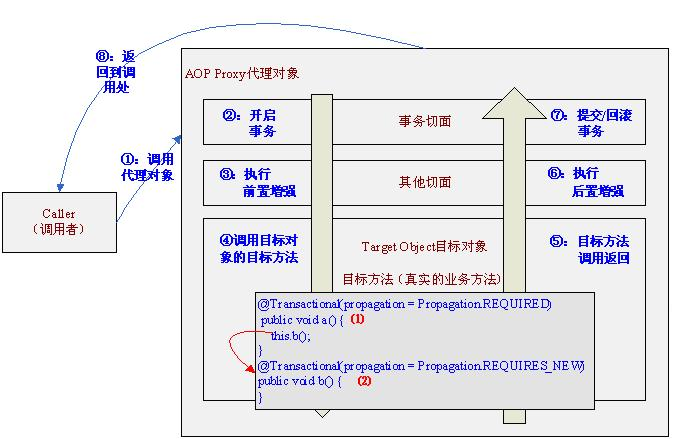

# Spring Framework

## Web MVC

## Cache

1. 注解

@CacheConfig、@Cacheable、@CachePut、@CacheEvict、@Caching

## Transactional 事务

### @Transactional 属性：

|        属性名     | 	                        说明 |
|------------------|-------------------------------|
| name             | 	当在配置文件中有多个 TransactionManager , 可以用该属性指定选择哪个事务管理器。  |
| propagation      | 	事务的传播行为，默认值为 REQUIRED。  |
| isolation        |	事务的隔离度，默认值采用 DEFAULT。  |
| timeout          |	事务的超时时间，默认值为-1。如果超过该时间限制但事务还没有完成，则自动回滚事务。  |
| read-only        |	指定事务是否为只读事务，默认值为 false；为了忽略那些不需要事务的方法，比如读取数据，可以设置 read-only 为 true。  |
| rollback-for     |	用于指定能够触发事务回滚的异常类型，如果有多个异常类型需要指定，各类型之间可以通过逗号分隔。  |
| no-rollback- for |	抛出 no-rollback-for 指定的异常类型，不回滚事务。  |

### 传播行为

PROPAGATION_REQUIRED：如果当前没有事务，就新建一个事务，如果已经存在一个事务，就加入到这个事务中。这是最常见的选择。

PROPAGATION_SUPPORTS：支持当前事务，如果当前没有事务，就以非事务方式执行。

PROPAGATION_NOT_SUPPORTED：以非事务方式执行操作，如果当前存在事务，就把当前事务挂起。

PROPAGATION_MANDATORY：使用当前的事务，如果当前没有事务，就抛出异常。

PROPAGATION_NEVER：以非事务方式执行，如果当前存在事务，则抛出异常。

PROPAGATION_REQUIRES_NEW：新建事务，如果当前存在事务，把当前事务挂起。

PROPAGATION_NESTED：如果当前存在事务，则在嵌套事务内执行。如果当前没有事务，则执行与PROPAGATION_REQUIRED类似的操作。

### 隔离级别

|   隔离级别                   |        说明                                                          |             未处理问题              |
|-----------------------------|----------------------------------------------------------------------|-----------------------------------|
| READ UNCIMMITTED（未提交读）  | 在读取时是不会加锁的，但在更新数据时，对其加行级共享锁                      |   脏读，不可重复读，幻读             |
| READ COMMITTED（提交读）      | 写数据加行级排他锁，这样写过程是无法读取的，直到事务处理完毕才释放排他锁，给读的数据加行级共享锁，这样读的时候也是无法写的。 |  不可重复读，幻读                   |
| REPEATABLE READ（可重复读）   | 给写的数据加行级排他锁，事务结束释放，给读的数据加行级共享锁，事务结束后释放。 |  幻读                              |
| SERIALIZABLE（可串行化）      |   强制事务串行执行                                                        |                                  |

### 注意事项

  - @Transactional 只能应用到 public 方法才有效
  - 避免AOP的自调用问题

## Spring Boot Runner 启动器

功能：

CommandLineRunner、ApplicationRunner 接口的 Component 会在所有 SpringBeans都初始化之后， SpringApplication.run()之前执行，非常适合在应用程序启动之初进行一些数据初始化的工作。

CommandLineRunner接口可以用来接收字符串数组的命令行参数，ApplicationRunner 是使用ApplicationArguments 用来接收参数的。

应用场景：

- 启动时容器是初始化资源操作 （初始化线程池，加载安全证书，初始化Bean等）

相关类与注解：

|                            |                                                 | 
|----------------------------|-------------------------------------------------|
| CommandLineRunner          | 实现该接口的Bean或Component 会在所有 SpringBeans都初始化之后， SpringApplication.run()之前执行   | 
| ApplicationRunner          | 同上， 但参数被封装在ApplicationArguments里。   |
| Order                      | 控制多个Runner的执行顺序。      |
| ApplicationArguments       |   ApplicationArguments接口提供了对原始String[]参数以及option和non option参数的访问。     |

实例：

```java
@Component
@Order(1)
public class MyCommandLineRunner implements CommandLineRunner{

    @Override
    public void run(String... var1) throws Exception{
        System.out.println("This will be executed when the project starts.");
    }
}

@Component
@Order(2)
public class MyApplicationRunner implements ApplicationRunner {

    @Override
    public void run(ApplicationArguments var1) throws Exception{
        System.out.println("The will be executed after MyCommandLineRunner.run()!");
    }
}
```

[Spring Boot 如何解决项目启动时初始化资源](https://yq.aliyun.com/articles/664614)

## Spring MVC 流程


## AOP 自我调用问题

问题描述：



外部通过AOP 代理对象调用方法， 可以执行切面， 但是目标对象内部的自我调用将无法实施切面中的代码， 因为此时`this`指向目标对象， 而不是代理对象。

### 解决办法一： 通过ThreadLocal暴露代理对象

通过AOPContext获取代理类。需要更改配置文件、注解。

1. 配置AOP， 启用expose-proxy。

```java
@EnableAspectJAutoProxy(proxyTargetClass=true, exposeProxy=true) 
```

2. 在调用时， 调用AopContext.currentProxy()获得当前代理目标

```java
@Service
public class SelfCallServiceImpl implements SelfCallService {

    public void selfCallA() {
        //通过暴露ThreadLocal的方式获取代理对象
        ((SelfCallService)AopContext.currentProxy()).selfCallB();
    }

    public void selfCallB() {
        System.out.println("我是方法B");
    }
}
```

### 解决办法二： 通过初始化方法的方式

通过注入ApplicationContext对象，然后从ApplicationContext对象中获取被代理的类。配置文件不做变动。

```java
@Service
public class SelfCallServiceImpl implements SelfCallService{
    //注入ApplicationContext对象
    @Autowired
    private ApplicationContext applicationContext;

    private SelfCallService selfCallService;
    @PostConstruct
    public void setSelfCallService(){
        selfCallService = applicationContext.getBean(SelfCallServiceImpl.class);
    }

    public void selfCallA() {
        selfCallService.selfCallB();
    }

    public void selfCallB() {
        System.out.println("我是方法B");
    }
}
```

### 解决办法三： 通过BeanPostProcessor的方式

Spring容器中加入BeanPostProcessor之后，针对容器中每个创建的Bean对象（Spring自身创建的Bean和应用程序创建的Bean），都会回调postProcessBeforeInitialization和postProcessAfterInitialization方法。通过BeanPostProcessor把代理类注入。

```java
public interface SelfCallWrapperService {
    void setSelfObj(Object obj);
}
```

```java
public class BeanPostProcessorSelfCall implements BeanPostProcessor {
 
    public Object postProcessBeforeInitialization(Object bean, String s) throws BeansException {
 
        return bean;
    }
 
    public Object postProcessAfterInitialization(Object bean, String s) throws BeansException {
        if (bean instanceof SelfCallWrapperService) {
            ((SelfCallWrapperService)bean).setSelfObj(bean);
        }
        return bean;
    }
}
```

```java
@Service
public class SelfCallServiceImpl implements SelfCallService, SelfCallWrapperService {
 
    private SelfCallService selfCall;
 
    public void selfCallA() {
        selfCall.selfCallB();
    }

    public void selfCallB() {
        System.out.println("我是方法B");
    }

    public void setSelfObj(Object obj) {
        selfCall = (SelfCallService)obj;
    }
}
```

[Spring AOP中自我调用的问题](https://blog.csdn.net/zknxx/article/details/72585822)

## Spring Caching

| Class / Annotation | Description |
|--------------------|-------------|
| `Cache`            | Cache Interface. Common implementations are `RedisCache`, `CaffeineCache`, Eh|
| `CacheManager`      | 缓存管理器，管理各种缓存（cache）组件 |
| `@Cacheable`        | 主要针对方法配置，能够根据方法的请求参数对其进行缓存    |
| `@CacheEvict `      | 清空缓存                                           | 
| `@CachePut`         | 保证方法被调用，又希望结果被缓存。 与@Cacheable区别在于是否每次都调用方法，常用于更新 |
| `@EnableCaching`    | 开启基于注解的缓存                                  |
| `@CacheConfig`      | 统一配置本类的缓存注解的属性                         |